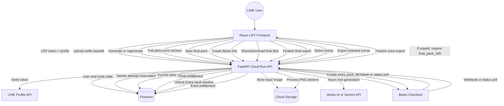

# Business Logic

This document describes the current production business logic implemented by the
codebase. The current model is pay-on-save with Beam payment links. The old coin
economy is legacy only and must not drive the active UI or export authorization.

## 1. Source of Truth

- `line_id` from LINE is the primary user identifier.
- Every backend route that reads or mutates user-owned state validates
  `Authorization: Bearer <LIFF_ACCESS_TOKEN>` against LINE and rejects user-id
  mismatches.
- The backend is the source of truth for generation count, cooldown, payment
  entitlement, current stickers, Extra Vault content, and export access.
- The frontend may render warnings and cache pending Beam checkout state, but it
  is not trusted for access control.

## 2. User and Cycle State

Each user has one active sticker cycle. A cycle contains:

- `current_cycle_id`
- `generation_count`
- `generation_limit` (`20`)
- `generation_locked_at`
- `generation_cooldown_until`
- `current_stickers`
- `current_stickers_job_id`
- `extra_vault`
- `extra_vault_expires_at`
- `final_pack_paid_at`
- `final_pack_exported_at`
- `final_pack_payment_link_id`
- `extra_pack_paid_at`
- `extra_pack_exported_at`
- `extra_pack_payment_link_id`
- `extra_pack_selected_ids`

New users are initialized with `coin_balance = 0` and `is_free_trial_used = false`
for backward-compatible schema shape only. Coins are not granted, sold, deducted,
or checked by the active production flow.

## 3. Generation Attempts

- Each cycle allows 20 accepted generation attempts.
- `Generate` and `Regenerate Unselected` share the same counter.
- An attempt is reserved atomically when `POST /api/v1/jobs/generate` is accepted
  by the backend. The asynchronous job may later fail, but the current production
  code does not refund or decrement the attempt.
- Attempts 1-14 proceed without warning.
- Attempts 15-17 return a gentle warning.
- Attempts 18-19 return a stronger warning.
- Attempt 20 is accepted, then the cycle is locked for any later generation.
- Attempts after 20 return `429` with `error_code = generation_limit_reached`
  and `product_id = final_pack_199`.
- If `final_pack_paid_at` exists and `final_pack_exported_at` is still empty, new
  generation is blocked. The user must finish saving/exporting the paid final
  pack first.

Approved backend warning copy:

| Attempt range | Level | Copy |
| --- | --- | --- |
| 15-17 | `gentle` | `ใกล้ครบโควต้าทดลองแล้ว เหลืออีก {remaining} ครั้งก่อนต้องปลดล็อกเพื่อบันทึกรูป` |
| 18-19 | `strong` | `เหลืออีก {remaining} ครั้งเท่านั้น บันทึกชุดนี้ได้ด้วยแพ็ก 199 บาท` |
| 20+ | `limit_reached` | `ครบโควต้าทดลองแล้ว ปลดล็อก 199 บาทเพื่อบันทึกสติกเกอร์ชุดนี้` |

## 4. Cooldown and Reset

- When the 20th attempt is reserved, the backend sets:
  - `generation_locked_at = now`
  - `generation_cooldown_until = now + 24 hours`
- During cooldown, the primary CTA is still Final Pack payment (`199 THB`).
- If the user pays during cooldown, they can save/export the current final pack.
- If cooldown has expired and the final pack was not paid, the next cycle-state
  read or generation request resets the cycle. There is no separate background
  reset worker in the current code.
- Reset clears generation count, current stickers, Extra Vault, payment state,
  lock fields, legacy extra-pick fields, and creates a new `current_cycle_id`.
- Uploading a new selfie from the frontend calls `POST /api/v1/jobs/reset`, which
  resets the active cycle immediately.
- After a final pack has already been exported, the next generation attempt also
  starts a fresh cycle.

## 5. Sticker Generation and Regeneration

The active generation pipeline is:

1. Frontend uploads a base64 selfie to `POST /api/v1/upload`.
2. Backend stores the image under `temp/uploads/...` in GCS and returns a
   `gs://` URI plus a signed URL.
3. Frontend calls `POST /api/v1/jobs/generate` with:
   - `user_id`
   - `image_uri`
   - `style`
   - `prompt`
   - `locked_indices`
4. Backend reserves one generation attempt and creates a Firestore `jobs`
   document.
5. The generation task runs asynchronously.
6. AI generates a square 4x4 green-screen sticker sheet.
7. The image processor validates the sheet, slices it into exactly 16 stickers,
   removes green background, cleans artifacts, adds a white stroke, and outputs
   370x320 PNG stickers.
8. Stickers and the raw grid are stored in GCS.
9. The current final sticker slots are persisted to the user document.

Regeneration uses `locked_indices`:

- Locked slots reuse the previous slot's blob.
- Unlocked slots use newly generated blobs.
- Replaced previous blobs are appended to `extra_vault`.
- Extra Vault starts collecting from the first regeneration that replaces an
  existing slot.

## 6. Final Pack

- Product ID: `final_pack_199`
- Price: `199 THB`
- Provider: Beam
- The final pack is the current set of 16 sticker slots in the active cycle.
- Saving/exporting the final pack always requires final pack payment, even before
  the 20-attempt limit.
- Payment success sets `final_pack_paid_at` and `final_pack_payment_link_id`.
- Payment success does not mark export success and does not reset the cycle.
- Export/save endpoints require `final_pack_paid_at`.
- Export success is recorded only when the frontend finishes the device save,
  native share, or ZIP download flow and calls
  `POST /api/v1/jobs/current/finalize-export`.
- Final export sets:
  - `final_pack_exported_at`
  - `extra_vault_expires_at = now + 24 hours`
  - purchase `exported_at`

Current final export paths:

- `GET /api/v1/jobs/current/share-file`
- `GET /api/v1/jobs/current/download-url`
- `GET /api/v1/jobs/current/download`
- `GET /api/v1/jobs/{job_id}/download`
- `POST /api/v1/jobs/current/finalize-export`

## 7. Extra Vault

- Extra Vault contains stickers replaced out of the final 16 during regeneration.
- Extra Vault is not a replacement picker in the main creation loop.
- Extra Vault URLs are hidden until the final pack is exported.
- Extra Vault becomes available for 24 hours after final pack export.
- If the vault expires, the backend returns it as empty/expired.
- The old Extra Picks unlock/apply endpoints now return `410 Gone` and must not be
  used for new UI.

## 8. Extra Pack

- Product ID: `extra_pack_99`
- Price: `99 THB`
- Provider: Beam
- Final pack must be exported before Extra Pack payment can be created.
- The user must select at least 1 and at most 16 Extra Vault item IDs.
- If fewer than 16 Extra Vault stickers exist, the user may buy/export all
  available selected stickers for the same `99 THB`.
- Payment success sets:
  - `extra_pack_paid_at`
  - `extra_pack_payment_link_id`
  - `extra_pack_selected_ids`
- Extra export includes only the paid selected Extra Vault IDs.
- Extra export must not include final pack stickers.
- Export success is recorded by `POST /api/v1/jobs/current/extra-vault/finalize-export`.

## 9. Payment Products

| Product ID | Amount | Grants |
| --- | ---: | --- |
| `final_pack_199` | 199 THB | Export entitlement for the current final 16 stickers |
| `extra_pack_99` | 99 THB | Export entitlement for 1-16 selected Extra Vault stickers |

Payment records are stored in `payments`; completed entitlements are stored in
`purchases`.

Minimum `payments` fields:

- `payment_link_id`
- `provider`
- `user_id`
- `cycle_id`
- `product_id`
- `reference_id`
- `amount_satang`
- `thb_amount`
- `status`
- `provider_status`
- `checkout_url`
- `redirect_url`
- `selected_extra_ids`
- `expires_at`
- `created_at`
- `updated_at`
- `paid_at`
- `processed_at`

Minimum `purchases` fields:

- `purchase_id`
- `user_id`
- `cycle_id`
- `product_id`
- `amount_satang`
- `provider`
- `payment_link_id`
- `source`
- `selected_extra_ids`
- `purchased_at`
- `exported_at`

## 10. Legacy and Compatibility Rules

- `coin_balance`, `is_free_trial_used`, and `total_spent_thb` may still exist on
  user documents for compatibility/history.
- `total_spent_thb` is incremented after successful Beam payment for reporting
  history, not as the current export gate.
- `GET /api/v1/users/{user_id}/permissions` still checks `total_spent_thb >= 30`
  in code, but it is legacy and is not used by the current frontend final/extra
  pack flow.
- New features must use product-specific paid/exported fields instead of coins or
  total-spent gates.

## 11. Main Flow

## 12. Required Test Cases

- New user sync creates a pay-on-save profile with zero coins and a fresh cycle.
- `line_id` mismatch between token profile and request user ID is rejected.
- Attempts 1-14 do not return warnings.
- Attempts 15-17 return gentle warnings with correct remaining count.
- Attempts 18-19 return strong warnings with correct remaining count.
- Attempt 20 is accepted and locks future generation for the cycle.
- Attempt 21 returns `429 generation_limit_reached`.
- Expired unpaid cooldown resets the cycle on cycle-state read or generation
  request.
- Paid but unexported final pack blocks more generation.
- Uploading a new selfie resets the current cycle.
- Regeneration preserves locked slots and replaces only unlocked slots.
- Replaced previous slots are appended to Extra Vault.
- Final export endpoints return `402 payment_required` before `final_pack_199`
  is paid.
- Final export finalize sets `final_pack_exported_at` and
  `extra_vault_expires_at`.
- Extra Vault is hidden before final export and visible after final export.
- Extra Vault expires 24 hours after final export.
- Extra payment creation rejects empty selection, more than 16 selections,
  unavailable IDs, unexported final pack, and expired vault.
- Extra export includes only `extra_pack_selected_ids`.
- Beam webhook rejects invalid signatures.
- Beam webhook/status polling is idempotent when `processed_at` already exists.
