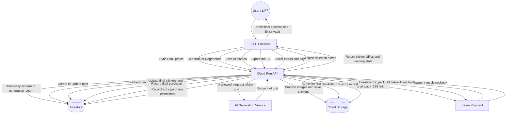

# Business Logic

This document is the source of truth for the updated pay-on-save model. The previous coin economy is removed from user-facing UI and business logic.

## 1. Core Rules

### A. User Identity

- `line_id` is the primary user identifier.
- Sensitive actions must be checked by the backend using the LIFF access token or a trusted session.
- The frontend must not be trusted for generation counts, payment entitlement, export access, or cooldown status.

### B. No Coin Economy

- Users do not receive free coins.
- Users do not buy coin packages.
- Generating and regenerating do not deduct coins.
- Any existing `coin_balance` field is legacy data only and must not drive new UI or access control.

### C. Trial Generation Counter

- Each cycle allows 20 total generation attempts.
- A generation attempt means any successful tap on `Generate` or `Regenerate`.
- `Generate` and `Regenerate` are counted together.
- Attempts 1-14 do not show a limit warning.
- Attempts 15-19 show a warning.
- Attempt 20 immediately blocks further generation and routes the user toward the 199 THB final pack.
- The generation counter must be updated atomically on the backend.

Approved Thai warning copy:

| Attempt range | Copy |
| --- | --- |
| 15-17 | `ใกล้ครบโควต้าทดลองแล้ว เหลืออีก {remaining} ครั้งก่อนต้องปลดล็อกเพื่อบันทึกรูป` |
| 18-19 | `เหลืออีก {remaining} ครั้งเท่านั้น บันทึกชุดนี้ได้ด้วยแพ็ก 199 บาท` |
| 20 | `ครบโควต้าทดลองแล้ว ปลดล็อก 199 บาทเพื่อบันทึกสติกเกอร์ชุดนี้` |

### D. 24-Hour Cooldown

- When attempt 20 is used, set `generation_locked_at` to the current backend time.
- Set `generation_cooldown_until = generation_locked_at + 24 hours`.
- If the user does not buy the final pack, the app shows a countdown until `generation_cooldown_until`.
- During countdown, the primary call to action is still the 199 THB final pack payment.
- If the user pays during cooldown, they can save the final pack.
- If cooldown ends without payment, reset the full cycle:
  - generation counter
  - current final stickers
  - Extra Vault
  - cycle payment state
  - lock and cooldown fields

### E. Final Pack Payment

- Saving the final stickers always requires payment.
- This applies even if the user has not reached the 20-attempt limit.
- Product ID: `final_pack_199`
- Price: 199 THB
- Provider: Beam
- Payment success grants export entitlement for the current final 16 stickers in the current cycle.
- Payment success does not reset the cycle by itself.
- The cycle should be finalized only after the save/export flow completes and the user reaches the success summary screen.

### F. Save Success Definition

- Browser and LIFF environments cannot guarantee that files are physically stored in the user's Photos app.
- Treat save as successful when the backend/frontend download or share flow has completed and the user reaches the success summary screen.
- After final save success:
  - mark the final pack as exported
  - keep the Extra Vault available for upsell
  - set Extra Vault expiry to 24 hours after final save/export success

### G. Extra Vault

- Extra Vault stores stickers that were replaced out of the final 16 during regeneration.
- Start collecting Extra Vault items from the first regenerate after the initial generate.
- Extra Vault is not a replacement picker during the main creation loop.
- Extra Vault is shown only after final pack save/export success.
- Extra Vault expires 24 hours after final pack save/export success.

### H. Extra Pack Payment

- Product ID: `extra_pack_99`
- Price: 99 THB
- Provider: Beam
- The user can select up to 16 Extra Vault stickers.
- If fewer than 16 Extra Vault stickers exist, the user can buy and export all available stickers for the same 99 THB price.
- Extra pack export includes only the selected Extra Vault stickers.
- Extra pack export must not include final pack stickers.
- After selected extra stickers are exported, the extra pack flow is complete.

## 2. Payment Products

| Product ID | Amount | Grants |
| --- | ---: | --- |
| `final_pack_199` | 199 THB | Export entitlement for the current final 16 stickers |
| `extra_pack_99` | 99 THB | Export entitlement for up to 16 selected Extra Vault stickers |

Payment records should be stored as purchase history by product and cycle, not as coin top-ups.

Minimum payment fields:

- `payment_link_id`
- `provider`
- `user_id`
- `cycle_id`
- `product_id`
- `amount_satang`
- `status`
- `provider_status`
- `checkout_url`
- `created_at`
- `updated_at`
- `paid_at`
- `processed_at`

Minimum purchase history fields:

- `purchase_id`
- `user_id`
- `cycle_id`
- `product_id`
- `amount_satang`
- `provider`
- `payment_link_id`
- `purchased_at`
- `exported_at`

## 3. Suggested User Cycle State

Store the active creation cycle on the user document or a dedicated cycle document.

Suggested fields:

- `current_cycle_id`
- `generation_count`
- `generation_limit`
- `generation_locked_at`
- `generation_cooldown_until`
- `current_stickers`
- `current_stickers_job_id`
- `current_stickers_updated_at`
- `extra_vault`
- `extra_vault_expires_at`
- `final_pack_paid_at`
- `final_pack_exported_at`
- `extra_pack_paid_at`
- `extra_pack_exported_at`

`extra_vault` item fields:

- `id`
- `source_job_id`
- `replaced_from_slot`
- `blob_name`
- `created_at`

## 4. Key Actors and Main Actions

| Actor | Role | Main Actions |
| --- | --- | --- |
| User | LINE user creating stickers | Login, upload selfie, generate, keep stickers, regenerate, pay, save final pack, optionally buy extras |
| LIFF Client | Mobile-first web app inside LINE | Show UI, collect user input, display counters/warnings, call backend, redirect to Beam, trigger save/export |
| Backend API | Source of truth for state and access | Validate auth, increment generation count, enforce limits, manage cycle state, create Beam links, process webhooks, authorize exports |
| AI Service | Sticker generation engine | Generate 4x4 sticker grids from user image and prompt |
| Image Processor | Backend image pipeline | Split grid, remove background, add stroke, save processed stickers |
| GCS | Sticker asset storage | Store current final stickers and Extra Vault images with lifecycle/expiry policy |
| Beam | Payment gateway | Collect payment and send payment status back to backend |

## 5. Main Data Flow

## 6. Required Test Cases

- Attempts 1-14 do not show warnings.
- Attempts 15-17 show the gentle warning with correct remaining count.
- Attempts 18-19 show the stronger warning with correct remaining count.
- Attempt 20 blocks further generation and surfaces the 199 THB final pack.
- Save to Photos before attempt 20 still requires `final_pack_199`.
- A user who reaches attempt 20 and does not pay sees a 24-hour countdown.
- After countdown ends without payment, the full cycle resets.
- Regeneration stores replaced final stickers into Extra Vault.
- Extra Vault is hidden before final save/export success.
- Extra Vault is shown after final save/export success.
- Extra Vault expires 24 hours after final save/export success.
- Extra cart allows at most 16 selected stickers.
- Extra cart can be purchased with fewer than 16 available stickers.
- Extra export contains only selected Extra Vault stickers.
- Coin balance and coin packages do not appear in the new UI.
