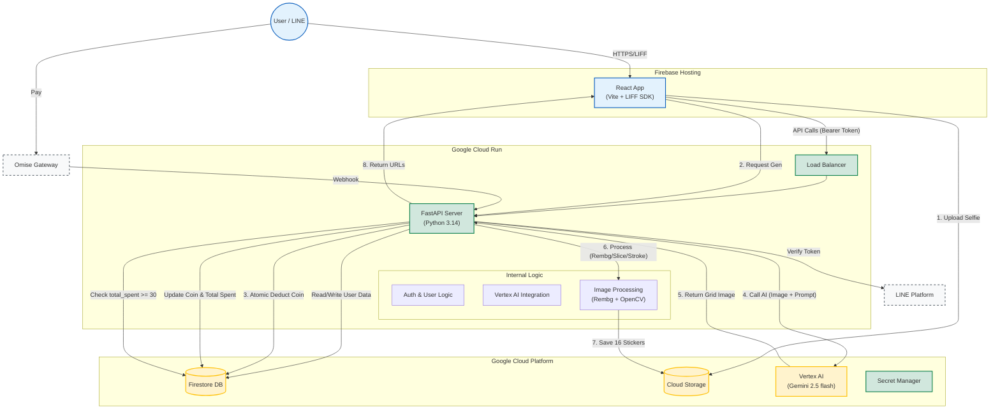

# High - Level Design : HLD

## 1. System Architecture Diagram (แผนภาพโครงสร้างระบบ)

## 2. Key Components & Responsibilities

ตารางนี้สรุปหน้าที่ของแต่ละส่วน เพื่อให้ทีม Frontend และ Backend เห็นภาพตรงกันครับ

| Component | Technology | Responsibility (หน้าที่หลัก) |
| --- | --- | --- |
| **Frontend** | **React + Vite**(Host on Firebase) | - **UI/UX:** แสดงผล, รับค่า Prompt, Preview รูป- **Upload:** อัปโหลดรูป Selfie ขึ้น GCS โดยตรง (ใช้ Signed URL)- **State:** จัดการ Loading State ระหว่างรอ Backend |
| **Backend API** | **Python (FastAPI)**(Run on Cloud Run) | - **Orchestrator:** ควบคุม Flow ทั้งหมด- **Auth:** ตรวจสอบ LIFF Token และจัดการ User Session- **Coin Logic:** หักเหรียญและเติมเงิน (Atomic Transaction)- **Download Gate:** เช็คเงื่อนไข `total_spent >= 30` |
| **Image Engine** | **Python Libraries**(rembg, Pillow, cv2) | - **BG Removal:** ลบพื้นหลังเขียวด้วย AI (`rembg`)- **Slicing:** ตัดภาพ 4x4 Grid ออกเป็น 16 ภาพย่อย- **Styling:** เพิ่มขอบขาว (White Stroke) และจัดขนาดภาพ |
| **AI Model** | **Vertex AI**(Gemini 1.5 Flash) | - **Generation:** สร้างภาพตาม Prompt ที่กำหนด (Agents.md)- **Safety:** กรองเนื้อหาที่ไม่เหมาะสมตาม Policy |
| **Database** | **Firestore** | - **Users:** เก็บ Coin Balance, Total Spent, History- **Jobs:** เก็บสถานะการ Gen (Pending, Done, Failed) |
| **Storage** | **Cloud Storage (GCS)** | - **Buckets:** แยกถังเก็บ Input (ลบใน 1 วัน) และ Output (ลบใน 1 วัน ถ้า user ไม่โหลด) และถ้ามีการ Download จาก User ให้เก็บไว้เป็น History  |

## 3. Core Business Flows (Logic Details)

### Flow A: The "Safe-Gen" Pipeline (กระบวนการสร้างสติกเกอร์)

นี่คือ Flow ที่ซับซ้อนที่สุด ซึ่งเราย้าย Logic มาทำที่ Backend ทั้งหมด:

1. **Upload:**
    - Frontend ขอ `Upload URL` จาก Backend
    - Frontend อัปโหลดรูป Selfie ไปที่ GCS
2. **Request Generation:**
    - Frontend ส่ง `POST /generate` พร้อม `gcs_uri` และ `style_id`
3. **Backend Processing:**
    - **Step 3.1 (Validation):** ตรวจสอบ `coin_balance >= 1`
    - **Step 3.2 (Deduction):** หัก 1 Coin ทันที (Atomic Write)
    - **Step 3.3 (AI):** ส่ง Prompt + URI ไป Vertex AI -> ได้รูป Grid 4x4
    - **Step 3.4 (Processing - *Highlight*):**
        - Backend โหลดรูป Grid
        - **Rembg:** ลบพื้นหลัง
        - **Slicing:** ตัดเป็น 16 รูป
        - **Post-process:** ใส่ขอบขาว
        - **Save:** บันทึก 16 ไฟล์ลง GCS (`/processed/...`)
    - **Step 3.5 (Response):** ส่ง List ของ Signed URL (16 รูป) กลับไปให้ Frontend
4. **Error Handling (Auto-Refund):**
    - ถ้า Error ที่ Step 3.3 หรือ 3.4 -> ระบบจะ **คืน 1 Coin** ให้ User อัตโนมัติ พร้อมบันทึก Log

### Flow B: Pay-to-Unlock (เงื่อนไขการดาวน์โหลด)

- User สามารถกด Generate เล่นได้เรื่อยๆ (ตราบใดที่มี Coin)
- เมื่อ User กดปุ่ม **"Download PNG"**:
    - Backend จะเช็ค field `total_spent_thb` ใน Firestore
    - **ถ้า >= 30:** อนุญาตให้ Download (ส่ง Link ไฟล์ความละเอียดสูง)
    - **ถ้าน้อยกว่า:** ส่ง Error Code `403_PAYMENT_REQUIRED` -> Frontend เด้ง Popup ให้เติมเงิน

### Flow C: Onboarding (ผู้ใช้ใหม่)

- เมื่อ User เข้าครั้งแรก:
    - ระบบเช็ค `line_id` ใน Firestore
    - ถ้าไม่พบ -> สร้าง Record ใหม่
    - **Action:** เติม `coin_balance = 2` และ set `is_free_trial_used = true` ทันที

---

## 4. Infrastructure & Security

1. **API Security:**
    - ทุก Request ต้องมี Header `Authorization: Bearer <LIFF_TOKEN>`
    - Backend ตรวจสอบ Token กับ LINE Platform ทุกครั้ง (หรือ Cache ไว้สั้นๆ)
2. **Secret Management:**
    - เก็บ `LINE_CHANNEL_SECRET`, `OMISE_SECRET_KEY` ใน **GCP Secret Manager** เท่านั้น (ห้าม Hardcode)
3. **Cost Control:**
    - **GCS Lifecycle:** ตั้งกฎลบไฟล์ในถัง `temp-inputs` และ `temp-outputs` ทุก 24 ชั่วโมง
    - **Cloud Run:** ตั้งค่า `max-instances` เพื่อป้องกันงบบานปลายกรณี Traffic พุ่งสูง