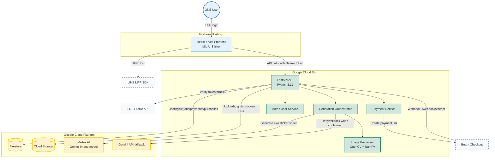

# High-Level Design (HLD)

## 1. Production Architecture

```mermaid
flowchart TD
    classDef client fill:#e3f2fd,stroke:#1565c0,stroke-width:2px;
    classDef server fill:#d1e7dd,stroke:#198754,stroke-width:2px;
    classDef storage fill:#fff3cd,stroke:#ffc107,stroke-width:2px;
    classDef external fill:#f8f9fa,stroke:#6c757d,stroke-width:2px,stroke-dasharray: 5 5;

    User((LINE User)):::client
    LIFF[LINE LIFF SDK]:::external
    LINE_API[LINE Profile API]:::external
    Beam[Beam Checkout]:::external

    subgraph Frontend_Zone [Firebase Hosting]
        WebClient["React + Vite Frontend\nMia-U-Sticker"]:::client
    end

    subgraph Backend_Zone [Google Cloud Run]
        API["FastAPI API\nPython 3.11"]:::server
        Auth["Auth / User Service"]:::server
        Generation["Generation Orchestrator"]:::server
        Payment["Payment Service"]:::server
        ImageProcessor["Image Processor\nOpenCV + NumPy"]:::server
    end

    subgraph Data_Zone [Google Cloud Platform]
        Firestore[(Firestore)]:::storage
        GCS[(Cloud Storage)]:::storage
        Vertex["Vertex AI\nGemini image model"]:::storage
        GeminiAPI["Gemini API fallback"]:::storage
    end

    User -- LIFF login --> WebClient
    WebClient -- LIFF SDK --> LIFF
    WebClient -- API calls with Bearer token --> API
    API -- Verify token/profile --> LINE_API
    API -- User/cycle/jobs/payments/purchases --> Firestore
    API -- Uploads, grids, stickers, ZIPs --> GCS

    API --> Auth
    API --> Generation
    API --> Payment
    Generation -- Generate 4x4 sticker sheet --> Vertex
    Generation -- Retry/fallback when configured --> GeminiAPI
    Generation --> ImageProcessor
    Payment -- Create payment link --> Beam
    Beam -- Webhook: /webhooks/beam --> API
```

## 2. Component Responsibilities

| Component | Technology | Responsibility |
| --- | --- | --- |
| Frontend | React 19, Vite, LIFF SDK, Axios | LINE login, image upload UI, prompt/style selection, sticker grid review, locked-slot regeneration, Beam redirect, payment status check, save/share/download flows, Extra Vault selection |
| Backend API | FastAPI on Cloud Run | Auth enforcement, generation cycle control, job creation/polling, payment link creation, Beam webhook handling, export authorization |
| User Service | Firestore async client | User sync, cycle defaults, atomic generation attempt reservation, 24-hour cooldown reset, current stickers, Extra Vault, paid/exported flags |
| Payment Service | Beam API + Firestore | Product validation, Beam payment link creation, signature verification, status sync, idempotent purchase recording |
| AI Service | Vertex AI with Gemini API fallback | Builds production prompts for `Pixar 3D` and `Chibi 2D`, creates square 4x4 green-screen sticker sheets, retries on transient/provider failures |
| Image Processor | OpenCV + NumPy | Validates supported 4x4 layout, slices grid into 16 cells, removes green background, cleans artifacts/fringes, adds white stroke, outputs LINE-sized 370x320 PNGs |
| Firestore | Google Cloud Firestore | Stores `users`, `jobs`, `payments`, and `purchases` |
| Cloud Storage | Google Cloud Storage | Stores uploaded source images, raw generated grids, processed sticker PNGs, and downloadable ZIP files; signed URLs are generated by the backend |
| Beam | External payment gateway | Hosts checkout and sends signed payment webhooks |

## 3. Runtime Flows

### 3.1 Auth and User Sync

1. Frontend initializes LIFF with `VITE_LIFF_ID`.
2. User logs in with LINE.
3. Frontend stores `liff.getAccessToken()` in local storage for API requests.
4. Frontend calls `POST /api/v1/auth/sync`.
5. Backend verifies the Bearer token by calling LINE Profile API.
6. Backend creates or updates the user document and returns normalized
   `generation_state`.

Auth rule: the token's LINE user ID must match every request `user_id`.

### 3.2 Generate and Regenerate

1. Frontend uploads base64 image to `POST /api/v1/upload`.
2. Backend validates JPEG/PNG/WEBP bytes and stores the file in GCS.
3. Frontend calls `POST /api/v1/jobs/generate`.
4. Backend atomically reserves one generation attempt in Firestore.
5. Backend creates a `jobs/{job_id}` document with `queued` status.
6. Async generation runs behind a process-wide semaphore.
7. AI creates a 4x4 sheet; the backend may retry up to three candidates and pick
   the lowest-risk valid result.
8. Image processor converts the sheet to 16 PNG stickers.
9. Backend saves sticker blobs and updates the user's `current_stickers`.
10. Existing unlocked/replaced slots are copied into `extra_vault`.
11. Frontend polls `GET /api/v1/jobs/{job_id}` and then refreshes
    `GET /api/v1/jobs/current`.

### 3.3 Generation Limit and Cooldown

- A cycle allows 20 accepted generation attempts.
- Attempt 20 is accepted, then the cycle is locked.
- Later generation requests return `429` with `generation_limit_reached`.
- If unpaid cooldown expires, `get_cycle_state` or the next generation attempt
  resets the cycle.
- A paid-but-unexported final pack also blocks more generation until export is
  finalized.

### 3.4 Final Pack Payment and Export

1. User chooses to save the final pack.
2. If `final_pack_paid_at` is missing, frontend opens the final checkout view.
3. Frontend calls `POST /api/v1/payments/create` with
   `product_id = final_pack_199`.
4. Backend creates a Beam payment link for 199 THB.
5. User returns from Beam to `/payment`.
6. Frontend checks `GET /api/v1/payments/status`; Beam can also notify
   `/webhooks/beam`.
7. Payment success records `final_pack_paid_at` and a `purchases` document.
8. Frontend saves via native file share when available, or downloads a ZIP URL.
9. Frontend calls `POST /api/v1/jobs/current/finalize-export`.
10. Backend records `final_pack_exported_at` and opens the Extra Vault 24-hour
    window.

### 3.5 Extra Vault Payment and Export

1. Extra Vault is visible only after final pack export.
2. User selects 1-16 Extra Vault item IDs.
3. Frontend calls `POST /api/v1/payments/create` with
   `product_id = extra_pack_99` and `selected_extra_ids`.
4. Backend validates final export, vault expiry, item availability, and selection
   limit.
5. Beam payment success records `extra_pack_paid_at` and
   `extra_pack_selected_ids`.
6. Frontend exports only the selected extra stickers via share files or ZIP URL.
7. Frontend calls `POST /api/v1/jobs/current/extra-vault/finalize-export`.

## 4. Data Ownership

| Data | Owner | Notes |
| --- | --- | --- |
| LINE access token | Frontend local storage | Sent as Bearer token; backend verifies with LINE |
| User profile | Firestore `users` | Updated on sync from verified LINE profile |
| Generation cycle | Firestore `users` | Active cycle state lives on the user document |
| Job status | Firestore `jobs` | Queue/processing/completed/failed plus generation state snapshot |
| Source image | GCS `temp/uploads/...` | Uploaded through backend base64 endpoint |
| Raw AI grid | GCS `users/{user}/jobs/{job}/grid.png` | Stored for QA/debugging |
| Final sticker PNGs | GCS `users/{user}/jobs/{job}/{index}.png` | Signed URLs generated on demand |
| Extra Vault items | Firestore `users.extra_vault` + GCS blobs | Reuses old final sticker blobs replaced during regeneration |
| Payment link | Firestore `payments` | One document per Beam payment link |
| Purchase entitlement | Firestore `purchases` | One document per successful payment link |

## 5. API Surface

Current frontend-used endpoints:

- `POST /api/v1/auth/sync`
- `POST /api/v1/upload`
- `POST /api/v1/jobs/generate`
- `GET /api/v1/jobs/{job_id}`
- `GET /api/v1/jobs/current`
- `POST /api/v1/jobs/reset`
- `GET /api/v1/jobs/current/share-file`
- `GET /api/v1/jobs/current/download-url`
- `POST /api/v1/jobs/current/finalize-export`
- `GET /api/v1/jobs/current/extra-vault`
- `GET /api/v1/jobs/current/extra-vault/share-file`
- `POST /api/v1/jobs/current/extra-vault/download-url`
- `POST /api/v1/jobs/current/extra-vault/finalize-export`
- `POST /api/v1/payments/create`
- `GET /api/v1/payments/status`
- `POST /webhooks/beam`

Compatibility endpoints:

- `GET /api/v1/jobs/current/download`
- `GET /api/v1/jobs/{job_id}/download`
- `POST /api/v1/jobs/current/extra-picks/unlock` returns `410 Gone`
- `POST /api/v1/jobs/current/extra-picks/apply` returns `410 Gone`
- `GET /api/v1/users/{user_id}/permissions` is legacy and must not be used for
  the current final/extra pack gate.

## 6. Security and Operational Notes

- All user-owned API calls require `Authorization: Bearer <LIFF_ACCESS_TOKEN>`.
- Backend validates the token with LINE Profile API and caches successful
  profiles briefly.
- Beam webhooks require `X-Beam-Signature`; signatures are verified using
  HMAC-SHA256 and the configured webhook secret.
- Export endpoints perform backend entitlement checks, not frontend-only checks.
- GCS access is via backend-generated signed URLs. The backend uses IAM signing
  when running on Cloud Run.
- CORS is currently configured as `*` in code; production hardening should
  restrict it to the Firebase Hosting origin.
- Generation concurrency is controlled by `GENERATION_CONCURRENCY`; per-user
  pacing is controlled by `GENERATION_COOLDOWN_SECONDS`.
- AI provider, Beam credentials, LINE config, and GCS bucket are environment
  variables loaded by `pydantic-settings`.

## 7. Non-Goals in Current Production

- No coin packages.
- No free starting coins.
- No Omise integration.
- No `total_spent_thb >= 30` download gate for the active flow.
- No Extra Picks swapping UI before final export.
- No background worker that resets expired cycles without a user-triggered read or
  write.
