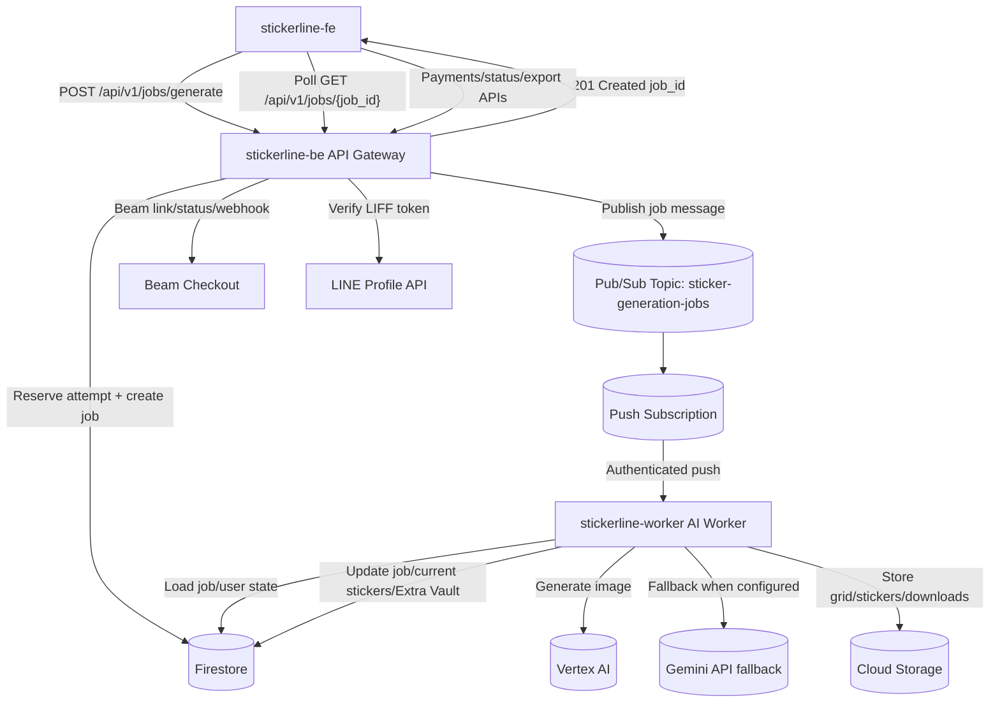

# Infra Action Plan: Decoupling the Backend

## Goal

Refactor the StickerLine AI backend from one monolithic Cloud Run service into a
decoupled two-service backend:

- `stickerline-be`: public API Gateway for fast request/response work.
- `stickerline-worker`: private AI Worker for long-running generation and image
  processing.

The target is to keep `POST /api/v1/jobs/generate` consistently fast while the
heavy AI/image workload scales independently. The capacity target remains a best
case of 10,000 daily active users and a stress target of 100 generation jobs per
minute, subject to actual job duration and Google Cloud quota.

## Confirmed Environment

| Item | Value |
| --- | --- |
| Project ID | `skitkerline` |
| Project number | `917214899974` |
| Region | `asia-southeast1` |
| GCS bucket | `skitkerline_stickerline` |
| Artifact Registry repo | `asia-southeast1-docker.pkg.dev/skitkerline/stickerline` |
| Frontend production URL | `https://stickerline-fe-917214899974.asia-southeast1.run.app` |
| Alert email | `chonlathan@manee-son.com` |
| Deployment actor for now | `chonlathan@manee-son.com` |
| Environment model | Single GCP project for current phase |

## Current Production

- **Architecture:** One monolithic FastAPI service, `stickerline-be`, deployed on
  Cloud Run.
- **Processing model:** The service handles lightweight API requests and
  long-running AI/image processing jobs in the same process.
- **Concurrency control:** Generation is currently guarded by
  `asyncio.Semaphore` and in-memory per-user cooldown inside `stickers.py`.
- **Bottleneck:** Heavy image jobs compete with auth, payment, status polling, and
  current-sticker reads. This can increase latency and cause inefficient Cloud
  Run scaling.
- **Implementation note:** `backend/app/services/pubsub_service.py` does not
  exist yet. It will be created during the gateway refactor phase.

## Target Architecture



## Service Responsibilities

### `stickerline-be` API Gateway

- Public Cloud Run service.
- Handles LIFF auth, user sync, uploads, job creation, job status reads,
  current-sticker reads, payment creation/status/webhook, and export endpoints.
- On generation request:
  1. verifies LINE token;
  2. reserves generation attempt atomically;
  3. creates `jobs/{job_id}`;
  4. publishes a Pub/Sub message;
  5. returns `201 Created` immediately.
- Does not call AI or run image processing after the refactor.

Recommended runtime shape:

- CPU: `1`
- Memory: `1Gi`
- Concurrency: `80`
- Min instances: `1`
- Max instances: define explicitly during deploy, initial recommendation `20`
- Ingress: public for current phase
- CORS origin: `https://stickerline-fe-917214899974.asia-southeast1.run.app`

### `stickerline-worker` AI Worker

- Private Cloud Run service.
- Receives Pub/Sub authenticated push requests.
- Runs the existing generation pipeline moved out of the API route into a shared
  job processor module.
- Calls Vertex AI and current Gemini API fallback according to existing code.
- Runs image processing with OpenCV/NumPy.
- Updates job status and user current sticker state in Firestore.

Recommended runtime shape:

- CPU: `4`
- Memory: `4Gi`
- Concurrency: `1`
- Min instances: `0`
- Max instances: `200`
- Ingress: `internal`
- Authentication: `--no-allow-unauthenticated`
- Entrypoint: worker FastAPI app, for example `uvicorn app.worker:app`

## Service Accounts and IAM

Confirmed service accounts:

- `stickerline-be-sa@skitkerline.iam.gserviceaccount.com`
- `stickerline-worker-sa@skitkerline.iam.gserviceaccount.com`
- `stickerline-pubsub-invoker@skitkerline.iam.gserviceaccount.com`

Runtime mapping:

| Runtime component | Service account |
| --- | --- |
| `stickerline-be` | `stickerline-be-sa@skitkerline.iam.gserviceaccount.com` |
| `stickerline-worker` | `stickerline-worker-sa@skitkerline.iam.gserviceaccount.com` |
| Pub/Sub push OIDC caller | `stickerline-pubsub-invoker@skitkerline.iam.gserviceaccount.com` |

### Gateway Runtime Roles

Grant to `stickerline-be-sa`:

- `roles/datastore.user`
- `roles/storage.objectAdmin`
- `roles/secretmanager.secretAccessor`
- `roles/pubsub.publisher` on topic `sticker-generation-jobs`
- `roles/iam.serviceAccountTokenCreator` if the gateway continues to generate
  GCS signed URLs through IAM signing

### Worker Runtime Roles

Grant to `stickerline-worker-sa`:

- `roles/datastore.user`
- `roles/storage.objectAdmin`
- `roles/aiplatform.user`
- `roles/secretmanager.secretAccessor`
- `roles/iam.serviceAccountTokenCreator` if the worker generates GCS signed URLs
  through IAM signing

### Pub/Sub Push Caller Roles

Grant to `stickerline-pubsub-invoker`:

- `roles/run.invoker` on Cloud Run service `stickerline-worker` only.

Grant to Pub/Sub service agent:

- Principal:
  `service-917214899974@gcp-sa-pubsub.iam.gserviceaccount.com`
- Role:
  `roles/iam.serviceAccountTokenCreator`
- Target service account:
  `stickerline-pubsub-invoker@skitkerline.iam.gserviceaccount.com`
- Role:
  `roles/pubsub.publisher`
- Target topic:
  `sticker-generation-jobs-dlq`
- Role:
  `roles/pubsub.subscriber`
- Target subscription:
  `sticker-generation-jobs-worker-push`

This allows Pub/Sub to mint an OIDC token as the push caller service account.
The Pub/Sub subscriber binding is also required for DLQ forwarding because the
service agent must acknowledge source subscription messages after moving them
to the dead-letter topic.

### Deployment Actor Roles

For `chonlathan@manee-son.com` to run bootstrap/deploy scripts during this phase,
the account needs deploy-time permissions such as:

- Cloud Run Admin
- Artifact Registry Writer
- Service Account User on `stickerline-be-sa` and `stickerline-worker-sa`
- Pub/Sub Admin
- Secret Manager Admin or Secret Manager Secret Accessor plus separate secret
  creation process
- Monitoring Editor
- IAM permissions to bind the specific roles above, or an admin applies IAM
  bindings once before deploy

## Pub/Sub Design

### Resources

- Main topic: `sticker-generation-jobs`
- Push subscription: `sticker-generation-jobs-worker-push`
- Dead-letter topic: `sticker-generation-jobs-dlq`
- Dead-letter subscription: `sticker-generation-jobs-dlq-sub`

### Message Contract

Publish JSON as the Pub/Sub message data:

```json
{
  "schema_version": 1,
  "job_id": "job_uuid",
  "user_id": "Uxxxxxxxx",
  "cycle_id": "cycle_uuid"
}
```

Rules:

- Firestore remains the source of truth.
- `job_id` is the only required identifier for processing.
- `user_id` and `cycle_id` are included for validation, logging, and future
  debugging.
- Worker must handle duplicate delivery idempotently.

### Delivery Settings

Recommended initial settings:

- Push endpoint: `https://<stickerline-worker-url>/pubsub/push`
- OIDC service account:
  `stickerline-pubsub-invoker@skitkerline.iam.gserviceaccount.com`
- Ack deadline: `600s`
- Retry minimum backoff: `60s`
- Retry maximum backoff: `600s`
- Dead-letter max delivery attempts: `5`
- Message retention: default `7 days`
- Ordering: disabled

## Worker Execution Pattern

Phase 1 decision: **process inside the Pub/Sub push request**.

Flow:

1. Pub/Sub pushes the message to `/pubsub/push`.
2. Worker validates the Pub/Sub envelope and decodes message data.
3. Worker loads `jobs/{job_id}`.
4. Worker atomically claims the job if it is still `queued`.
5. Worker processes AI generation and image processing.
6. Worker writes terminal state:
   - `completed`, or
   - `failed` for non-retryable/app-level failures.
7. Worker returns `2xx` only after the job reaches a terminal state.

Rationale:

- Pub/Sub retry and DLQ semantics stay simple.
- If the worker process dies before completion, Pub/Sub redelivers.
- This avoids acknowledging a message before durable work is complete.

Constraint:

- Pub/Sub push ack deadline is capped at 600 seconds. If real p99 job duration
  approaches or exceeds 10 minutes, move to a phase 2 execution model such as:
  - Cloud Tasks with longer dispatch semantics and clearer per-task retry;
  - Pub/Sub pull worker with explicit lease extension;
  - Cloud Run Jobs for batch-style generation.

## Idempotency and Job State

The worker must treat Pub/Sub as at-least-once delivery.

Recommended job state additions:

- `queued_at`
- `processing_started_at`
- `completed_at`
- `failed_at`
- `worker_attempt`
- `worker_instance`
- `pubsub_message_id`
- `last_error`

Claim rule:

- Process only if current status is `queued`.
- If status is `processing`, `completed`, or `failed`, return `2xx` unless a
  separate stale-processing recovery policy is implemented.
- Increment `worker_attempt` when claiming.

Future stale recovery:

- If status is `processing` and `processing_started_at` is older than a chosen
  timeout, allow a new delivery to reclaim the job.
- This should be added only after initial worker stability is proven.

## Secret Manager Mapping

Confirmed secret names:

| Env var | Secret name | Gateway | Worker | Notes |
| --- | --- | --- | --- | --- |
| `LINE_CHANNEL_SECRET` | `line-channel-secret` | Yes | Maybe | Worker only needs this if shared settings still require it |
| `BEAM_MERCHANT_ID` | `beam-merchant-id` | Yes | No | Used by payment service |
| `BEAM_API_KEY` | `beam-api-key` | Yes | No | Used by payment service |
| `BEAM_WEBHOOK_HMAC_KEY` | `beam-webhook-hmac-key` | Yes | No | Used by webhook verification |
| `GEMINI_API_KEY` | `gemini-api-key` | No | Yes | Needed for current `gemini_api` fallback |

Non-secret environment variables:

- `PROJECT_ID=skitkerline`
- `GCS_BUCKET_NAME=skitkerline_stickerline`
- `LIFF_CHANNEL_ID`
- `BEAM_BASE_URL`
- `PAYMENT_REDIRECT_URL=https://stickerline-fe-917214899974.asia-southeast1.run.app/payment`
- `PAYMENT_WEBHOOK_PUBLIC_URL`
- `PAYMENT_LINK_EXPIRY_MINUTES=30`
- `PAYMENT_CURRENCY=THB`
- Beam payment method flags
- `CORS_ALLOWED_ORIGINS` comma-separated exact frontend/local origins.
- `CORS_ALLOW_ORIGIN_REGEX` for Cloud Run frontend URL variants such as
  `https://stickerline-fe-<hash>-as.a.run.app`.
- `VERTEX_MODEL=gemini-3-pro-image-preview`
- `VERTEX_LOCATION=global`
- `GENAI_PROVIDER=vertex`
- `GENAI_FALLBACK_PROVIDER=gemini_api`
- generation retry/concurrency tuning vars
- `GENERATION_DISPATCH_MODE=local_async` for rollback-safe monolith behavior
  or `GENERATION_DISPATCH_MODE=pubsub` after the worker path is ready.
- `PUBSUB_PROJECT_ID=skitkerline` optional; defaults to `PROJECT_ID`.
- `STICKER_GENERATION_TOPIC=sticker-generation-jobs`
- `PUBSUB_PUBLISH_TIMEOUT_SECONDS=10`
- `ENABLE_PUBSUB_WORKER_ENDPOINT=false` on `stickerline-be`
- `ENABLE_PUBSUB_WORKER_ENDPOINT=true` on `stickerline-worker`
- Pub/Sub subscription names for infra scripts/worker code

Implementation note:

- Gateway publish mode should not initialize AI/image/storage worker dependencies
  in the request path. Those dependencies remain only for `local_async` fallback
  and the worker service.

## Networking and Security

### Gateway

- Public Cloud Run service for current phase.
- Restrict CORS to:
  `https://stickerline-fe-917214899974.asia-southeast1.run.app`
- Also allow the active Cloud Run frontend hash URL through
  `CORS_ALLOW_ORIGIN_REGEX`.
- Recommended next hardening:
  - Global External HTTPS Load Balancer
  - Cloud Armor managed WAF rules
  - Cloud Armor rate limiting for generation/payment endpoints

### Worker

- Deploy with `--no-allow-unauthenticated`.
- Use ingress `internal`.
- Allow invocation only through IAM by
  `stickerline-pubsub-invoker@skitkerline.iam.gserviceaccount.com`.
- Validate Pub/Sub push envelope and authenticated request context.

Staging validation:

- Confirm Pub/Sub push can invoke the worker with `internal` ingress in this
  project/region configuration.
- If Cloud Run ingress rejects Pub/Sub push during staging, fallback is:
  `ingress=all` plus authenticated IAM only. This is still not publicly usable
  without a valid identity token and `run.invoker`.

## Deployment Strategy

Short-term decision: use shell scripts, not Terraform yet.

Files to create during implementation:

- `Infra/bootstrap_infra.sh`
  - one-time/idempotent infra setup;
  - creates Pub/Sub topic, DLQ topic, subscriptions, service accounts, IAM
    bindings, optional monitoring email channel, and validates required
    services/secrets;
  - can be run before worker deploy for topics/IAM, then rerun after worker
    deploy to create/update the push subscription.
- `backend_stickerline-be.sh`
  - builds/pushes the backend image or reuses an image tag;
  - deploys Cloud Run service `stickerline-be`;
  - uses runtime SA `stickerline-be-sa`;
  - sets gateway env vars/secrets;
  - defaults to `GENERATION_DISPATCH_MODE=local_async` and
    `ENABLE_PUBSUB_WORKER_ENDPOINT=false`.
- `backend_stickerline-worker.sh`
  - builds/pushes the worker image or reuses an image tag;
  - deploys Cloud Run service `stickerline-worker`;
  - uses runtime SA `stickerline-worker-sa`;
  - sets worker env vars/secrets;
  - uses private/authenticated ingress settings;
  - defaults to `ENABLE_PUBSUB_WORKER_ENDPOINT=true`, `concurrency=1`,
    `cpu=1`, `timeout=600`, and `max-instances=200`.

Terraform will be deferred until the flow is stable.

## Budget and Quota Guardrails

No hard daily AI cap is set because usage can correlate with revenue. Instead,
use guardrails:

- Billing budget alerts at 50%, 80%, 100%, and 150%.
- Worker max instances capped at `200`.
- Worker default CPU is `1` so `200` max instances fits the current
  `CpuAllocPerProjectRegion=200 vCPU` regional quota. If worker CPU is raised
  to `2`, cap max instances at `100` or request a regional CPU quota increase.
- Cloud Armor rate limiting in front of the public gateway.
- App-level overload protection:
  - if queue depth or oldest unacked age exceeds threshold, temporarily reject new
    generation requests with a friendly "system busy" message;
  - keep payment/status/export endpoints available.
- Alert immediately on any DLQ message.
- Track Vertex/Gemini cost per successful generated pack once billing export is
  enabled.

Capacity formula:

```text
sustainable_jobs_per_minute = max_worker_instances / average_job_duration_minutes
```

Examples:

- 200 workers and 2-minute average jobs = about 100 jobs/minute.
- 200 workers and 4-minute p95 jobs = about 50 jobs/minute before backlog grows.

## Observability

### Logging

- Continue standard Python logging into Cloud Logging.
- Add structured fields in worker logs:
  - `job_id`
  - `user_id`
  - `cycle_id`
  - `worker_attempt`
  - `pubsub_message_id`
  - generation duration
  - image processing duration
  - total worker duration

### Metrics Dashboard

Create a Cloud Monitoring dashboard with separate staging/prod sections or
labels, even though the current phase uses one project.

Widgets:

- Pub/Sub undelivered messages
- Pub/Sub oldest unacked message age
- DLQ message count
- Gateway request count
- Gateway 5xx rate
- Gateway p99 latency
- Worker instance count
- Worker CPU utilization
- Worker memory utilization
- Worker request count and 5xx rate
- Vertex/Gemini error count from logs

### Alerts

Alert channel:

- Email: `chonlathan@manee-son.com`

Initial alerts:

- High: DLQ message count > 0.
- High: oldest unacked Pub/Sub message age > 5 minutes.
- High: undelivered messages > 10 for 5 minutes.
- Medium: gateway 5xx rate > 1%.
- Medium: gateway p99 latency > 1 second.
- Medium: worker 5xx/failure spike.
- Medium: worker memory utilization > 85% for 5 minutes.
- Medium: Vertex/Gemini error spike.

Initial SLO targets:

- `POST /api/v1/jobs/generate` p99 < 1 second.
- Queue wait p95 < 60 seconds.
- End-to-end generation p95 < 4 minutes.
- End-to-end generation p99 < 6 minutes.
- DLQ count should be 0 in production.

## Job Duration Measurement Plan

Before load testing, measure 20-50 real completed jobs.

Current quick measurement:

- Use `jobs.created_at -> jobs.updated_at` for `status=completed`.
- This approximates total job duration in the current monolith.

After worker refactor, persist:

- `queued_at`
- `processing_started_at`
- `completed_at`
- `failed_at`

Derived metrics:

- Queue wait: `processing_started_at - queued_at`
- Worker duration: `completed_at - processing_started_at`
- End-to-end duration: `completed_at - queued_at`
- Failure duration: `failed_at - processing_started_at`

Use p50/p95/p99 to decide whether:

- `min-instances=0` is acceptable;
- `max-instances=200` is sufficient;
- Pub/Sub push is still suitable;
- a pull worker, Cloud Tasks, or Cloud Run Jobs is needed.

## Migration Phases

### Phase 1: Infra Bootstrap and Dependency Prep

- Create/validate Pub/Sub topic and DLQ resources.
- Create/validate IAM bindings for gateway, worker, Pub/Sub invoker, and Pub/Sub
  service agent.
- Add `google-cloud-pubsub` to backend requirements.
- Add config values for Pub/Sub topic and project.
- Keep existing monolith behavior until gateway publish and worker are ready.

### Phase 2: Gateway Refactor

- Create `backend/app/services/pubsub_service.py`.
- Refactor `POST /api/v1/jobs/generate`:
  - reserve attempt;
  - create job with `queued_at`;
  - persist `request_payload` so a separate worker can reconstruct the job;
  - if `GENERATION_DISPATCH_MODE=pubsub`, publish Pub/Sub message and persist
    `pubsub_message_id`/`published_at`;
  - if `GENERATION_DISPATCH_MODE=local_async`, keep `asyncio.create_task` as the
    rollback-safe execution path.
- Preserve response contract for frontend polling.
- Keep status/current/export/payment endpoints in gateway.

### Phase 3: Worker Implementation

- Reuse `backend/app/services/generation_job_processor.py` from the Phase 1
  checkpoint.
- Create a worker FastAPI entrypoint through the shared FastAPI app.
- Add `POST /pubsub/push`, gated by `ENABLE_PUBSUB_WORKER_ENDPOINT`.
- Decode Pub/Sub message data and validate schema/user/cycle references.
- Claim queued jobs idempotently with a Firestore transaction.
- Run existing AI/image pipeline.
- Write `completed` or `failed` state.
- Return `2xx` only after terminal state.

### Phase 4: Deployment Scripts

- Create `backend_stickerline-be.sh`.
- Create `backend_stickerline-worker.sh`.
- Create `Infra/bootstrap_infra.sh`.
- Deploy gateway and worker from the same backend app/Dockerfile.
- Configure Cloud Run secrets through Secret Manager.
- Configure push subscription to the stable worker URL.
- Keep gateway in `GENERATION_DISPATCH_MODE=local_async` until Phase 5
  end-to-end Pub/Sub validation passes.

### Phase 5: Staging Test and Observability

- Deploy full stack to staging-equivalent configuration in the current project.
- Create a generation job and verify:
  - gateway responds < 1 second;
  - Pub/Sub message is published;
  - worker receives authenticated push;
  - job moves to `completed`;
  - frontend polling still works;
  - payment/export flows still work.
- Build dashboard and alert policies.
- Measure 20-50 real jobs and record p50/p95/p99.

### Phase 6: Load and Failure Testing

- Simulate generation bursts.
- Verify queue depth and worker scaling.
- Force worker failures and confirm retry/DLQ behavior.
- Confirm duplicate Pub/Sub deliveries do not double-process completed jobs.
- Verify worker is not invokable without IAM.

## Risks and Mitigations

| Risk | Impact | Mitigation |
| --- | --- | --- |
| AI model preview instability | Failed or slow generation | Keep current Vertex/Gemini fallback strategy and alert on provider errors |
| Worker cold starts | Longer first-job wait | Measure p95 queue wait; move worker `min-instances` to 1 if needed |
| Pub/Sub push 600s limit | Long jobs may redeliver | Measure p99; switch execution pattern if jobs approach 10 minutes |
| Poison messages | Infinite retry/cost | DLQ after 5 delivery attempts |
| Duplicate delivery | Double processing | Firestore job claim/idempotency |
| Worker scaling too high | Cost spike/quota pressure | Max instances 200, budget alerts, queue overload protection |
| Public gateway abuse | Cost and availability risk | CORS restriction, Cloud Armor WAF/rate limit in next hardening phase |
| Secret sprawl | Credential exposure | Secret Manager mapping and least-privilege service accounts |

## Acceptance Criteria

- `POST /api/v1/jobs/generate` on `stickerline-be` responds in < 1 second p99
  under normal load.
- A generated job is published to Pub/Sub and processed by `stickerline-worker`.
- `jobs/{job_id}` reaches `completed` with 16 result slots.
- Current stickers and Extra Vault behavior remain compatible with the frontend.
- Worker service uses `stickerline-worker-sa`.
- Gateway service uses `stickerline-be-sa`.
- Pub/Sub push uses `stickerline-pubsub-invoker`.
- Worker cannot be called without valid IAM authorization.
- DLQ receives messages after repeated worker failures.
- Monitoring dashboard shows queue depth, oldest unacked age, gateway latency,
  worker utilization, and DLQ count.
- Alerts are configured to email `chonlathan@manee-son.com`.
